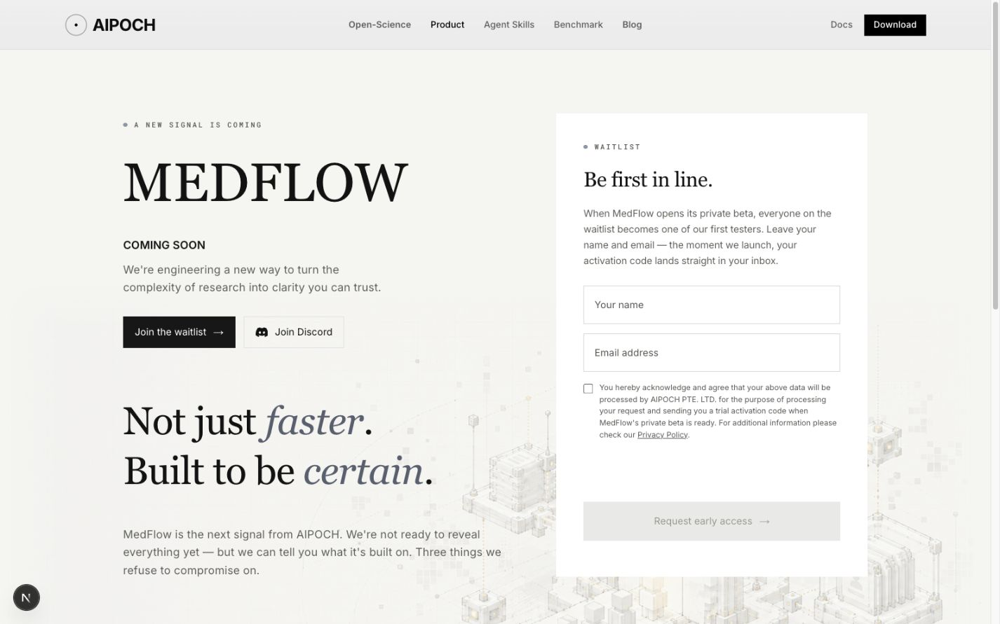

# MedFlow route replacement

The redesigned page is rendered directly by `app/(commonLayout)/medflow/page.tsx`
at the existing canonical URL, https://aipoch.com/medflow. It uses native React
content and the common layout's navigation/footer. There is no iframe, separate
HTML application, preview-state query, or simulated submission timer in this route.

The old `/medflow-redesign` page is retired. Its page component now permanently
redirects to `/medflow`, dropping preview state/result parameters. Its standalone
experience, CSS, state helpers, and duplicate assets have been removed. The original
artwork is served from `public/medflow/` and the original site fonts are reused.

The form retains React Hook Form validation and the existing `submitMedFlowMember`
service. Requests remain `POST /api/v1/members` with `display_name`, `email`, and
`source: medflowpre` (the configured API base can override `/api`). Explicit consent
is required. Pending requests lock the inputs and button, errors retain values for
retry, and only a successful response shows the submitted first name and confetti.
Duplicate responses continue to follow the backend's success/error contract.

## Page dates

Only https://aipoch.com/medflow receives a new page modification date:
`MEDFLOW_PAGE_LAST_MODIFIED = '2026-09-20'` in `medflow-metadata.ts`, consumed by
`app/sitemap.ts`. Existing shared-navigation dates, other page dates, newer API
content dates, Wiki dates, and sitemap exclusions are preserved. The retired preview
was already excluded and remains excluded as a redirect. Sitemap tests verify this.

## Verification

- Unit tests: 250 passed, 0 failed.
- Focused desktop/mobile E2E: 13 passed, 1 existing desktop skip for the mobile-only
  long-name regression. Tests cover 320/390/768/1280/1440 px overflow, the existing
  canonical route/shared shell, required consent/email validation, exact API payload,
  single pending request, disabled controls, personalized success/focus/hash, long
  names, HTTP 409/429/500 retry, and the retired preview redirect.
- TypeScript and production build: passed.
- Biome lint on all 14 touched application/test files: passed.
- Full repository lint still reports unrelated existing diagnostics (22 errors,
  40 warnings, schema-version info); no lint configuration was weakened.
- Browser visual inspection: desktop and mobile on the actual `/medflow` route.
  Screenshots below include the local Next.js development indicator.
- No protected runtime, environment, dependency, build, proxy, or deployment
  configuration was changed. This branch does not merge or deploy the website.

